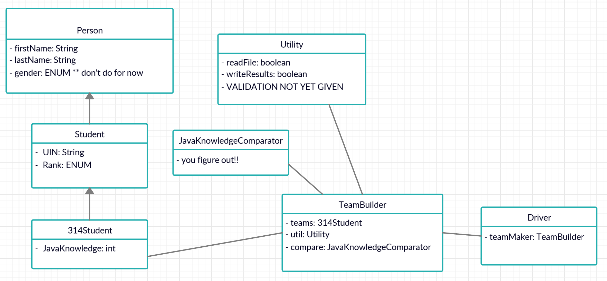

# Group Creator

A group simulator that creates groups of 2 people based on responses from a survey in a CSV file. This was completed as a project for CSCE 314 in Spring 2020, in which the grouping was intended for students in a Java course. 

## Table of Contents
- [About](#about)
  - [How It Groups](#how-it-groups)
  - [Program Design](#program-design)

## About

### How It Groups

The primary factor in grouping is the rank of Java knowledge (1-5). The purpose of this simulator is to create balanced groups, so no 2 people weak in Java get paired together. In this case, the groups (1,5), (2,4), and (3,3) are very balanced and good groups. The simulator also takes into account the section of the students. For instance, someone from section 502 cannot be grouped with someone from section 503. 

The goal is to get some output like this: 

        502 - Bowen Lupoli (4) Jamila Booth (2)

### Program Design

Here is the provided UML: 

Class_Data.csv: Contains the survey responses. An actual survey was not performed, since this file was provided. It was assumed the survey led to these responses. 

ErrorLog.txt: Contains any errors found in the data. For instance, if there is an odd number of students, the left over student will be added to the error log. Another example is if survey response is not correct, like if a non-integer or 0 rank was provided. 

results.txt: Contains the grouping results. 

  Copyright © 2020 ashoksteelers12

